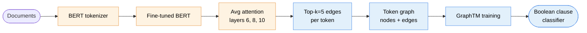

# Attention-Distilled Graph Tsetlin Machine

A Graph Tsetlin Machine that inherits BERT's attention edges as its
graph topology. After extraction BERT is discarded and the student
learns pure Boolean clauses. 94.77% on R8, fully interpretable.

> University of Agder (UiA)

## Pipeline



Orange nodes are the BERT teacher pipeline, used only to derive the
graph topology. Once top-k edges are extracted the teacher is
discarded. Blue nodes are the student pipeline and run with no
neural component at inference.

## Result

| Dataset | Student (TM) accuracy | Teacher (BERT) | Method |
|---|---|---|---|
| R8 (Reuters-8) | mean 94.77%, std 0.23 across 5 seeds | ~98% | top-k attention edges from BERT layers 6, 8, 10 |

The student does not use BERT embeddings, attention values, or any
neural component at inference. BERT contributes only the discrete
top-k edges that define the graph. Everything downstream is
interpretable clause learning.

Per-seed numbers in `experiments/paper_b_attn_R8/seed_*/results.json`.

## Novelty

Prior knowledge distillation for Tsetlin Machines uses soft labels
(teacher logits). This work distills structure instead: which token
pairs the teacher considers related. The student inherits relational
priors without inheriting any parameters.

The attention extraction is data-only and one-shot. Once the top-k
edges are computed the BERT teacher is discarded and the GraphTM
trains in pure Boolean clause space.

## Repo layout

```
attention-distilled-graphtm/
├── README.md, LICENSE, CITATION.cff, requirements.txt
├── MODELS.md, FUTURE_WORK.md, .gitignore
├── src/
│   ├── eval/{logger.py, stats.py}
│   └── utils/load_bertgcn_splits.py
├── experiments/
│   ├── train_paper_b_attention_distill.py
│   └── paper_b_attn_R8/seed_{42,123,456,789,1337}/
├── data/precomputed_graphs/r8_subword_dep.pkl
├── results/paper_b_R8_5seeds.json
└── tests/
```

## Quickstart

```bash
pip install -r requirements.txt

# Set the BERT teacher location (see MODELS.md). Default: ~/model_archive
export BERT_MODEL_DIR=~/model_archive

# Run the distillation pipeline:
python experiments/train_paper_b_attention_distill.py
```

Hyperparameters (clauses, T, s, top-k, BERT layers) are set in `main()`
of the training script. See
`experiments/paper_b_attn_R8/seed_42/results.json` for the exact
config that produced the headline R8 result.

## External dependencies

- BERT teacher checkpoint (~4 GB). See [MODELS.md](MODELS.md) for the
  expected layout under `$BERT_MODEL_DIR`. The teacher is reproducible
  from HuggingFace `bert-base-uncased` and a standard fine-tuning
  recipe.
- R8 data is bundled as `data/precomputed_graphs/r8_subword_dep.pkl`
  (37 MB).

## Citation

```bibtex
@misc{attention_distill_graphtm_2026,
  title  = {Attention-Distilled Graph Tsetlin Machine: Inheriting BERT's Structural Priors Without Its Parameters},
  author = {Anwar},
  year   = {2026},
  note   = {University of Agder, in preparation}
}
```

## License

MIT. See [LICENSE](LICENSE).
